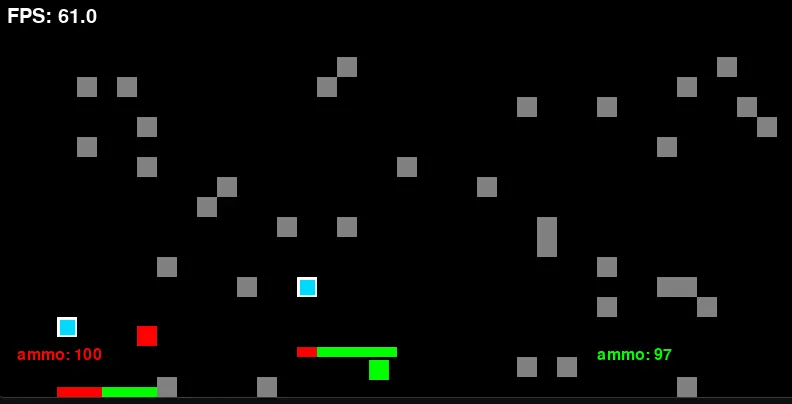
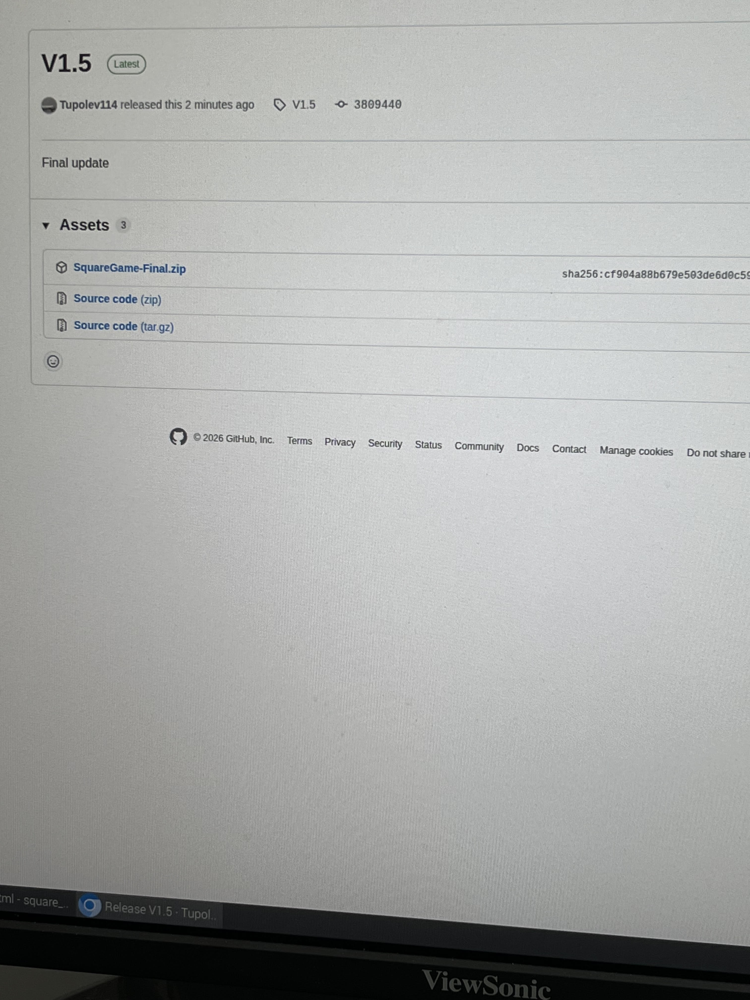

# Square_game

This is just a 2 player pvp game I made with pygame, its my first project and I'll admit, I used AI to help figure out netlify and github, but I learned, that is the important part.

Development story: One day in Spring, I started learning classes in python, as well as pygame, and thought: "Hey, what if I make a project" so then that started my development over this little game. I chose python because of its simple syntax. I had to use ChatGPT to learn about pygame at first, but I used it less and less after I started learning more. After a few weeks, I was fixing problems myself. 
Over the course of summer break, a few things happened, first, I found out about NASA Stardance and thought of this game I made. Next came a phase of serious development. I had lots of time over break, so it was easy for me
to contribute many hours to this project over summer. After school started, I got pretty busy but tried to remain consistent. After one failed pygbag experiment, I decided to just let the player download pygame. But then I 
found out I had to make an exe file so at school lunch, so that's what I did. Battling github and hackatime were painful. I accidentally messed up the game python file with git pull and git push, and I spent 3 weeks trying to figure out hackatime. My project may not look like everyone else's but that is fine.

 Houston we are ready for launch!

Press left shift to attack if you are red player and right shift if you are green.
Use arrow keys if you are green, WASD if you are red, to swap weapons as red, use 1,2 and 3 and ctrl, "\" and return(enter) key as green, Im sure you can figure it out. Try to experiment in 2 player mode.
Have fun!

Project includes:
-Melee Weapons
-2 player mode
-1 player mode(vs bot)
-guns
-obstacles
-bot that uses A* navigation
-shields
-health bars
## Screenshots

### Latest Release

### Icon

### Github Release

